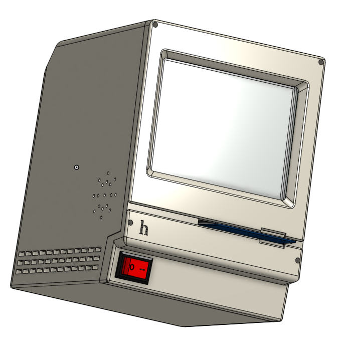
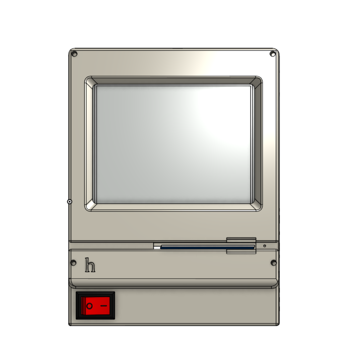
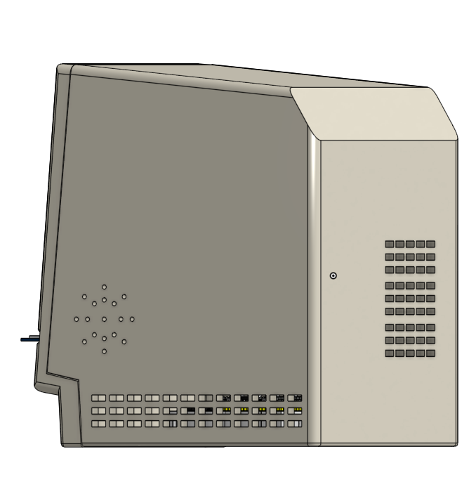
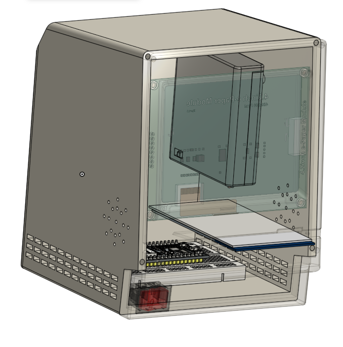
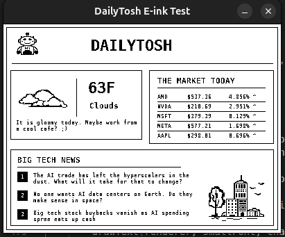
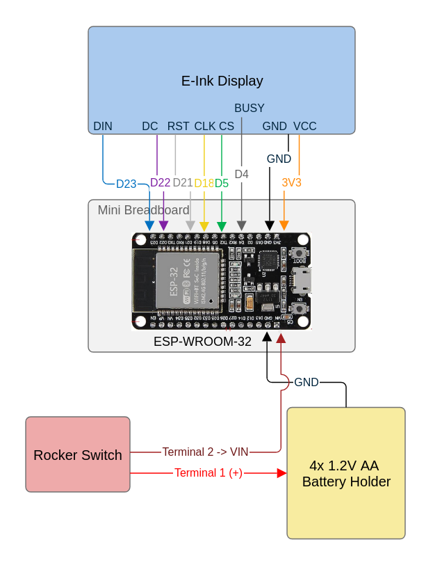

# DailyTosh
MacIntosh inspired **custom e-ink dashboard** featuring the hottest big-tech updates (+ the weather) and doubling as a business card holder!

**Photos:**

## Why I made this project
Every morning, before heading out to school or work, I usually *check the weather, listen to WSJ Tech News Briefing and view market updates*. I realized a custon e-ink dashboard displaying all of this information would keep me informed more effotlessly! I was also interested in how E-Ink displays can fetch and display live information over Wi-Fi, and needed a better place to store my business cards.

*Built for Hack Club Stasis^^*

## Features
- Displays the most important big-tech news
- Shows major technology sector market changes
- Shares the weather of the day and suggests ideal workspace based on weather conditions 
    - Nice weather -> work outside
    - Rainy/snowy/windy weather -> work from home
    - Cloudy weather -> work at a coffee shop/library
- Uses an E-Ink display for less power consumption
- Doubles as a business card holder with its disk opening

## How It Works
DailyTosh is ESP32 based and uses a Waveshare E-Ink display

1. The ESP32 connects to Wi-Fi
2. It fetches data from OpenWeatherMap API (weather data) and Finnhub API (market and news data)
3. Data is processed and displayd with a dashboard layout
4. DailyTosh also includes a power switch!

### Wiring Diagram

### Firmware

The ESP32 firmware *fetches weather, market and news data* from 2 APIs, processes the information and renders a custom dashboard on the E-Ink display.

**A custom filtering algorithm** scans over 100 big-tech keywords (for example " ai ", "amd", "semiconductor") to find the most relevant technology headlines on Finnhub. The firmware automatically *refreshes every 24 hours* and was originally developed as a **desktop C++ simulator** before being converted into ESP32 firmware in Arduino.

## Bill of Materials (BOM)

| Item | Purpose | Quantity | Cost | Link |
|--------|---------|---------|---------|---------|
| Switch | Turning the power on/off | 1 | $0.00 (Owned) | [Link](https://a.co/d/0hRUtY8s) |
| M3 Bolts, Nuts, and Threaded Inserts | Mounting the components | 10 | $0.00 (Owned) | - |
| Cream PLA Filament | Printing the enclosure | 1 | $0.00 (Owned) | [Link](https://a.co/d/07ec5Kyy) |
| Micro USB Cable | Programming the ESP32 | 1 | $6.99 | [Link](https://a.co/d/0cJpSzp2) |
| Mini Breadboard and Jumper Wires | Connecting the circuit | 1 | $0.00 (Owned) | [Link](https://a.co/d/0ctxR1cS) |
| AA Batteries | Powering the circuit | 4 | $0.00 (Owned) | [Link](-) |
| 4 AA Battery Holder | Holding and connecting the batteries | 1 | $0.00 (Owned) | [Link](https://a.co/d/0bJuIjxS) |
| ESP-WROOM-32 | Processing and displaying information | 1 | $9.39 | [Link](https://a.co/d/0hTfNaHV) |
| 4.2" E-Ink Display (with matching cable) | Displaying information on the dashboard | 1 | $34.99 | [Link](https://www.waveshare.com/4.2inch-e-paper-module.htm) |

**Total Cost:** $51.37  
**Shipping:** $10.00  
**Taxes:** $1.84  

**Grand Total:** $63.21

## References
I used several resources for inspiration, learning and visualization purposes

### Tutorials
**ESP32 and Waveshare E-Ink Display Tutorial from YouTube:** Used to learn how to connect a Waveshare E-Ink display to an ESP32

https://youtu.be/El38zVmog14?si=65B1_IF447uCydue

### Design Inspiration
**The 20 Greatest Home Computers – The Guardian**: Reading through this article showed me a lot of cool famous computer designs

https://www.theguardian.com/games/2020/sep/07/the-20-greatest-home-computers-ranked

**Apple Macintosh (1984)**: The design and the name of DailyTosh is inspired by the original Macintosh computer

### CAD Models
These CAD models from GrabCAD were used in the Assembly for visualization purposes
- ESP-WROOM-32 model
- 4.2" Waveshare E-Ink Display
- Mini breadboard
- 4xAA Battery Holder
